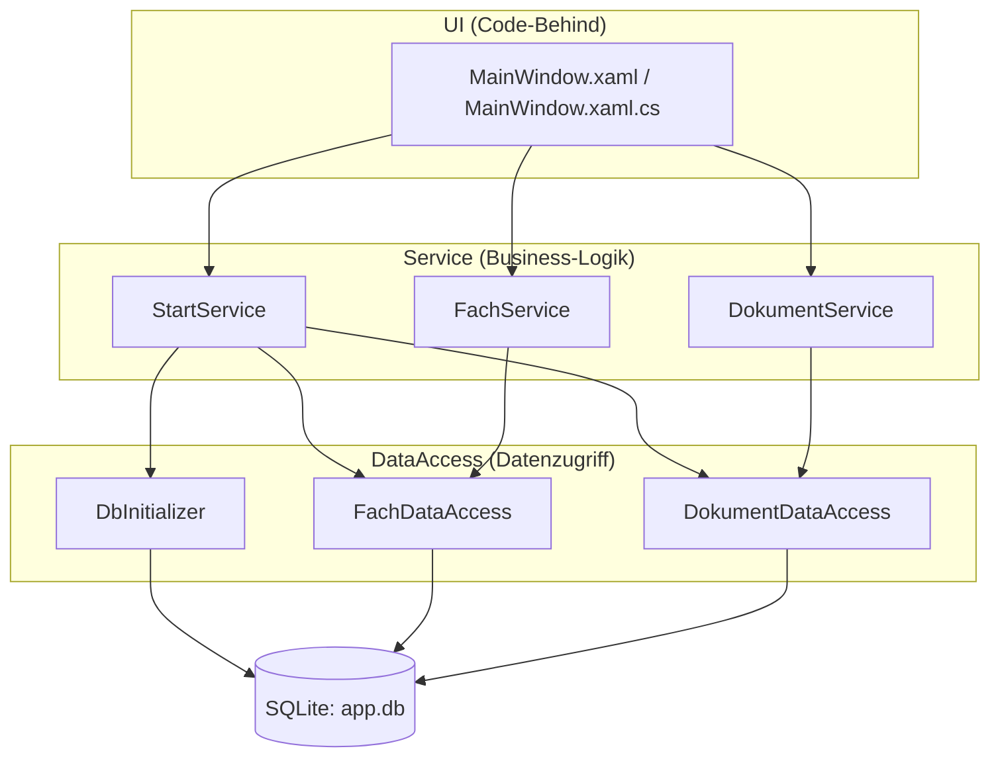

# K1 - Schichtenarchitektur

Die App ist in drei Schichten aufgeteilt. Jede Schicht kennt nur die direkt
darunterliegende - nie umgekehrt, und keine Schicht wird übersprungen.

## Schichtendiagramm

Die Klassen in `Models/` (`Fach`, `Dokument`) sind reine Datenobjekte und werden
von allen Schichten verwendet.

## Wer ruft wen?

| Serviceklasse   | Service-Methode                                   | Ruft auf in DataAccess                                  |
|-----------------|---------------------------------------------------|---------------------------------------------------------|
| StartService    | Initialisiere()                                   | DbInitializer.Initialize(), FachDataAccess.GetAll(), FachDataAccess.Add(), DokumentDataAccess.Add() |
| FachService     | GetAlle()                                         | FachDataAccess.GetAll()                                 |
| FachService     | Hinzufuegen(name, lehrperson)                     | FachDataAccess.ExistiertName(name), FachDataAccess.Add(fach) |
| FachService     | Loeschen(fachId)                                  | FachDataAccess.Delete(fachId)                           |
| DokumentService | GetByFach(fachId)                                 | DokumentDataAccess.GetByFach(fachId)                    |
| DokumentService | GetOffeneFristen()                                | DokumentDataAccess.GetOffeneFristen()                   |
| DokumentService | Hinzufuegen(titel, typ, dateipfad, frist, fachId) | DokumentDataAccess.Add(dokument)                        |
| DokumentService | Loeschen(dokumentId)                              | DokumentDataAccess.Delete(dokumentId)                   |
| DokumentService | AbgabeUmschalten(dokument)                        | DokumentDataAccess.SetAbgegeben(id, neuerStatus)        |
| DokumentService | MarkiereAlsAbgegeben(dokumentId)                  | DokumentDataAccess.SetAbgegeben(id, true)               |
| DokumentService | ZaehleOffene(dokumente)                           | - (rechnet auf der bereits geladenen Liste)             |
| DokumentService | ZaehleUeberfaellige(dokumente)                    | - (rechnet auf der bereits geladenen Liste)             |

## Was liegt wo?

- **UI:** Klicks entgegennehmen, Eingaben weiterreichen, Listen und Statuszeile
  aktualisieren, Rückfragen (MessageBox). Kein SQL, kein `using SchulApp.DataAccess`.
- **Service:** Regeln (Name/Titel nicht leer, Fachname eindeutig, Standardtyp
  "Auftrag"), Speicherformat der Frist, Abgabe-Workflow, Ablauf beim Programmstart.
  Regelverletzungen werden als `ValidierungsException` gemeldet, die UI zeigt sie
  als Hinweis.
- **DataAccess:** sämtliche SQL-Befehle und die Verbindung zur SQLite-Datenbank.

## Kontrolle (B4)

Suche nach `Sqlite` in `MainWindow.xaml.cs` und im Ordner `Services/`: keine Treffer.
